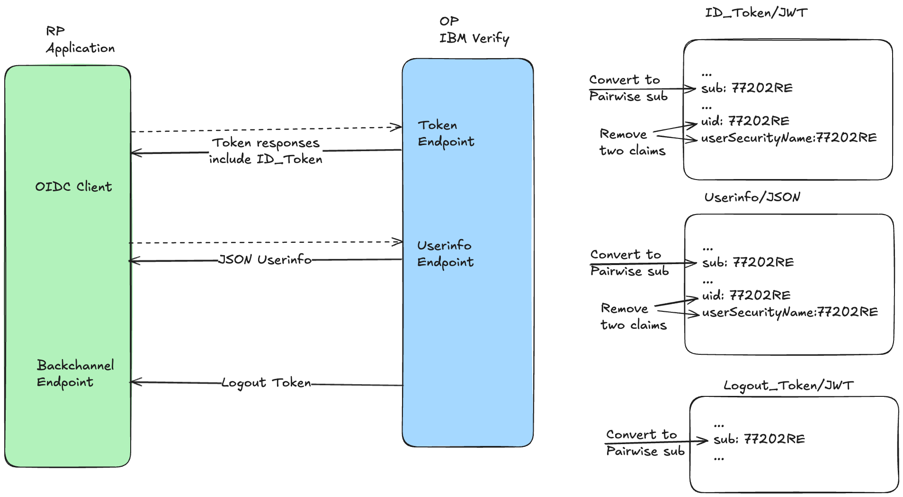
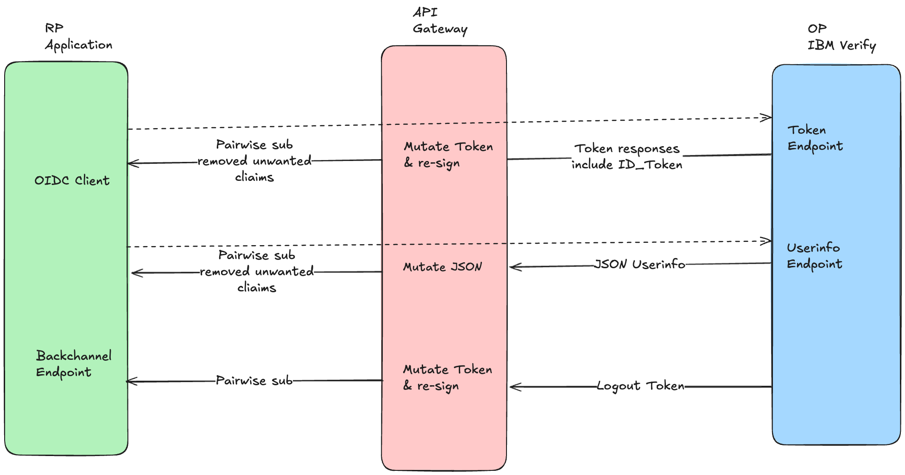

# API Gateway Token Transform (DEMO)

This repository is a demo showing how to use OpenResty (NGINX + Lua) as a proxy in front of IBM Verify SaaS to perform runtime transformations for OIDC metadata, ID Tokens, and Logout tokens.

The project demonstrates two proxy modes:

- Reverse proxy to IBM Verify (client-facing API Gateway):
  - OIDC metadata endpoint: when the gateway responds to discovery requests, it returns JSON where any tenant-specific URLs pointing at IBM Verify are rewritten to the API Gateway URL.
  - Token endpoint: when the gateway forwards token responses back to clients, it inspects ID Tokens (JWTs), replaces the ID Token "sub" with a pairwise-sub identifier, and trims unnecessary claims (keeping only a minimal set required by the relying party).

- Forward proxy to IBM Verify (gateway calling IBM Verify):
  - RP backchannel logout endpoint: when the gateway forwards client logout requests to IBM Verify, it inspects the Logout Token (JWT in the request) and replaces the "sub" with the pairwise-sub identifier required by the upstream IBM Verify tenant.

This is a demo — the code is intentionally small and illustrative. It focuses on the transformation logic and how to wire it into OpenResty using Lua.

## Contract (what the gateway does)

- Inputs:
  - Upstream IBM Verify URLs (discovery, token, RP backchannel logout)
  - Incoming HTTP requests from clients to the API Gateway
  - JWTs (ID Token or Logout Token) signed by IBM Verify

- Outputs:
  - Rewritten discovery JSON pointing at the API Gateway host
  - Token responses where ID Token subjects are converted to a pairwise sub (and JWT is re-signed or returned as a transformed JWT placeholder for the demo)
  - Forwarded logout requests with transformed Logout Token `sub` claim

- Error modes:
  - If a JWT cannot be parsed or verified, the gateway returns 400/401 and logs the error.
  - If discovery JSON cannot be parsed or upstream is unreachable, the gateway returns a 502/504 as appropriate.

## Assumptions and scope

- This repo is a demo and does not include production-ready key management.
- Pairwise subject algorithm: the demo uses an HMAC-like deterministic function (HMAC-SHA256) over the original subject and a per-client salt to generate a pairwise-sub. Replace with your organization's proper pairwise algorithm as required.
- JWT signing/verification in the demo may use locally configured test keys. In production, use proper key rotation and JWKS from the identity provider.
- We assume OpenResty with lua-resty libraries available: `lua-resty-jwt`, `lua-resty-http`, and `lua-resty-jwt-validators` (or similar). The README shows example dependencies and nginx configuration pointers.

## Example architecture

Client -> API Gateway (OpenResty) -> Upstream OAuth2 Provider

Two major flows:

1. Discovery (reverse proxy):
  - Client: GET http://gateway.example.com:8080/oauth2/.well-known/openid-configuration
  - Gateway: fetch upstream discovery from the configured upstream provider, replace tenant URLs in the discovery JSON with the gateway base URL, and return JSON

2. Token response transform (reverse proxy):
  - Client: POST http://gateway.example.com:8080/oauth2/token
  - Gateway: forward request to the configured upstream token endpoint, receive token response containing an ID Token (JWT). The gateway parses the ID Token, attempts signature verification using the upstream JWKS discovered from the tenant's OIDC metadata, replaces `sub` with a sector-aware pairwise-sub, trims configured claims using a trimlist, and re-signs the transformed ID Token (HS256 in this demo). In production, replace demo signing with your secure key management and asymmetric signing.

3. RP Backchannel Logout (forward proxy):
  - Gateway forwards client logout request to the configured upstream. Before sending upstream, it parses the Logout Token JWT in the request, replaces `sub` with pairwise-sub, and forwards the request.

4. Userinfo (reverse proxy):
  - Client: GET http://gateway.example.com:8080/oauth2/userinfo
  - Gateway: calls the upstream userinfo endpoint on the configured provider, transforms the returned JSON by replacing `sub` with the pairwise-sub for the requesting client, trims claims to a configured allowlist, and returns the modified JSON to the client.

5. Rest forward (transparent forward proxy for REST endpoints):
  - Client: Any HTTP method to http://gateway.example.com:8080/oauth2/<path>
  - Gateway: transparently forwards the request to the configured upstream provider preserving method, headers and body. No JWT claim transformation is performed for these proxied routes — they are simple pass-throughs.

## Example configuration snippets

These snippets are conceptual examples to wire into `nginx.conf` / OpenResty. The repo should include Lua handlers that perform these transformations.

nginx (actual locations used in this repo):

```nginx
server {
  listen 8080;
  server_name _;

  # Discovery endpoint (reverse proxy)
  location = /oauth2/.well-known/openid-configuration {
    default_type application/json;
    content_by_lua_file conf/lua/handlers/discovery_proxy.lua;
  }

  # Token endpoint (reverse proxy)
  location = /oauth2/token {
    default_type application/json;
    content_by_lua_file conf/lua/handlers/token_proxy.lua;
  }

  # Userinfo endpoint (reverse proxy)
  location = /oauth2/userinfo {
    default_type application/json;
    content_by_lua_file conf/lua/handlers/userinfo_proxy.lua;
  }

  # Generic rest request forward (transparent proxy)
  location ~ ^/oauth2(/|$) {
    proxy_set_header Host <UPSTREAM_HOSTNAME>;
    proxy_pass https://oauth_backend$request_uri;
  }

  # Forward proxy for RP backchannel logout
  location = /rp/backchannel_logout {
    default_type application/jwt;
    content_by_lua_file conf/lua/handlers/logout_forward.lua;
  }
}
```

Key Lua responsibilities (what each handler does):

- discovery_proxy.lua
  - Perform upstream GET to IBM Verify discovery URL
  - Replace occurrences of upstream tenant URL(s) with the gateway URL
  - Return modified JSON body and copy relevant response headers

- token_proxy.lua
  - Proxy POST to upstream token endpoint
  - Parse JSON response; extract `id_token`
  - Decode and verify JWT (using JWKS or local key)
  - Compute pairwise-sub: e.g. pairwise = base64url(HMAC-SHA256(client_salt, original_sub))
  - Replace `sub` in JWT payload, remove any claims not in a configured allow-list (for example keep: sub, iss, aud, exp, iat, nonce)
  - Re-sign the JWT (or optionally wrap transformed claims in an application-specific envelope for demo)
  - Replace `id_token` in token response JSON and return to client

- logout_forward.lua
  - Read the inbound request body containing the Logout Token (JWT)
  - Decode and perform best-effort verification using the upstream JWKS discovered via OIDC metadata
  - Compute sector-aware pairwise-sub for the original subject
  - Trim claims according to the configured trimlist
  - Re-sign the transformed Logout Token (HS256 in this demo) and forward upstream

## Example pairwise-sub function (concept)

In Lua you can implement a deterministic pairwise subject function like:

1. pairwise = base64url(HMAC-SHA256(client_salt, sector_identifier || ":" || original_sub))
2. Optionally prefix with `pairwise:` or similar for debugging

Store `client_salt` and a `sector_identifier` per relying party (RP) — this demo uses a simple in-memory map for example only.

Trimlist semantics: the config uses a `trimlist` approach where any claim listed in the trimlist is removed from transformed tokens/userinfo responses. This is the inverse of an allowlist — use whichever model fits your privacy requirements.

## Example curl flows (demo)

# 1) Discovery
curl -v https://gateway.example.com/.well-known/openid-configuration

# 2) Token exchange (client facing)
curl -v -X POST https://gateway.example.com/token \
  -d 'grant_type=authorization_code&code=...' \
  -H 'Content-Type: application/x-www-form-urlencoded'

# 3) RP backchannel logout (gateway forwarding upstream)
curl -v -X POST https://gateway.example.com/rp/backchannel_logout \
  -H 'Content-Type: application/jwt' \
  --data-binary '@logout_token.jwt'

## Dependencies (OpenResty / Lua modules)

- OpenResty (recommend 1.19+ or later)
- lua-resty-http (for outbound http calls)
- lua-resty-jwt (for JWT decode/verify) or lua-jwt
- lua-resty-jwk or a small JWKS fetcher for verifying upstream tokens

Package install (example, on macOS with luarocks):

```
# install luarocks-managed packages (conceptual)
luarocks install lua-resty-http
luarocks install lua-resty-jwt
luarocks install lua-cjson
```

## Notes and next steps

- This README documents the intended behavior and mapping for the OpenResty handlers. The repository's next steps would be to:
  1. Implement `lua/handlers/discovery_proxy.lua`, `lua/handlers/token_proxy.lua`, and `lua/handlers/logout_forward.lua` with the described logic.
  2. Add a minimal set of unit/integration tests or curl scripts that use local test keys and a mocked IBM Verify upstream.
  3. Provide a Dockerfile and docker-compose for easy local runs.

## Completion summary


## Requirement (diagram)



This diagram highlights the high-level requirements: accept client requests at the gateway, verify/transform tokens (pairwise-sub, trim claims), and forward requests to upstream services.

## Solution (diagram)



The solution diagram shows the API Gateway components (Lua handlers and supporting libs), the verification/transform step, and the forwarded request to upstream services.


## Build and run (local demo)

Build the image from the repo root so the Dockerfile can COPY the repo into the image:

```sh
# from repo root
docker build -f docker/Dockerfile -t api-gateway-demo:local .
```

Run (the container will generate a demo RSA keypair in the mounted config dir on first start):

```sh
# run and map port 8080
docker run --rm -p 8080:8080 api-gateway-demo:local
```

## Opening in GitHub Codespaces or VS Code Remote Containers

This repo includes a devcontainer configured to build the `gateway` service via the included Dockerfile and docker-compose. Recommended steps:

1. In GitHub, click "Code" → "Open with Codespaces" or in VS Code use the Remote - Containers / Reopen in Container command.
2. The Codespace will build the `gateway` service using `docker-compose.yml`. The Dockerfile installs LuaRock dependencies at image build time.
3. To run the gateway inside the Codespace, build and start the compose services from the terminal in the container workspace root:

```sh
# from the repo root inside the Codespace
docker compose -f docker/docker-compose.yml up --build
```

If Codespaces runs into build timeouts, consider building the image locally and pushing to a registry, or preinstalling some dependencies in the image to shorten builds.

Notes:

Environment configuration
-------------------------

This project supports loading configuration from a `.env` file. The Lua module `conf/env.lua`
parses a simple `.env` file and `conf/config.lua` reads values from it with sensible defaults.

Supported environment variables (examples):

- GATEWAY_BASE_URL (default: http://localhost:8080/oauth2)
- UPSTREAM_BASE_URL (example: https://your-upstream.example.com/oauth2)
- UPSTREAM_SKIP_SSL_VERIFY (true/false, default: true)
- DEFAULT_SALT
- CLIENT_SALTS (format: "client1:salt1,client2:salt2")
- DEFAULT_SECTOR
- CLIENT_SECTORS (format: "client1:sector1,client2:sector2")
- DEFAULT_BACKCHANNEL_LOGOUT_URI
- CLIENT_BACKCHANNEL_LOGOUT_URIS (format: "client1:url1,client2:url2")
- CLAIMS_TRIMLIST (comma-separated list)
- USERINFO_TRIMLIST (comma-separated list)
- SIGNING_ALG
- SIGNING_KEY_PATH
- RE_SIGN_KEY

Place a `.env` file at the project root or `conf/.env`. Example (do NOT commit secrets):

GATEWAY_BASE_URL=http://localhost:8080/oauth2
UPSTREAM_BASE_URL=https://your-upstream.example.com/oauth2
CLIENT_SALTS=default_client:REDACTED_SALT,client_abc:REDACTED_SALT
